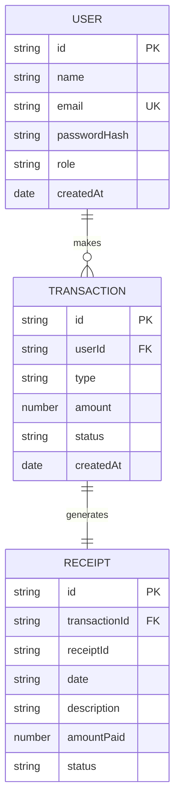
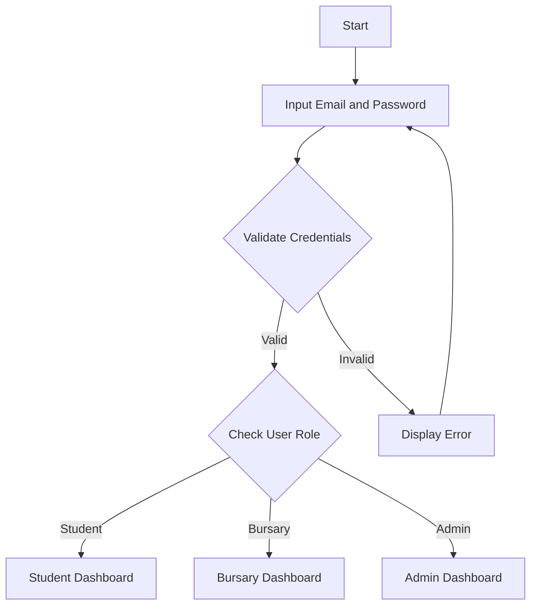
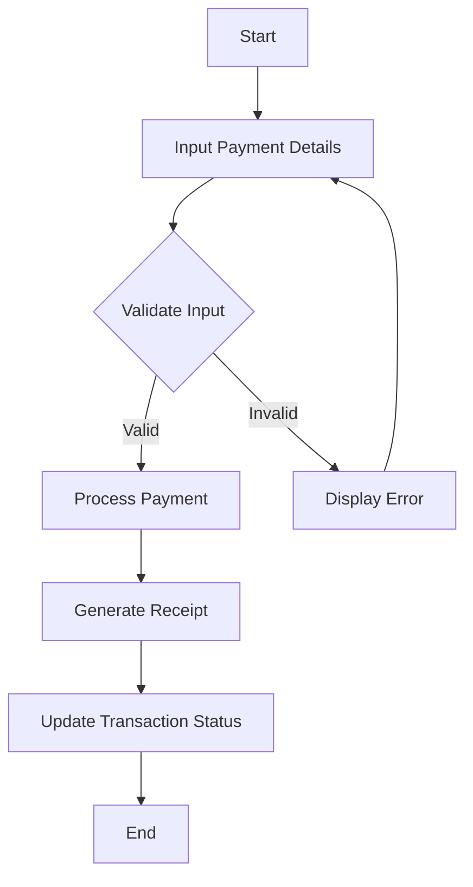
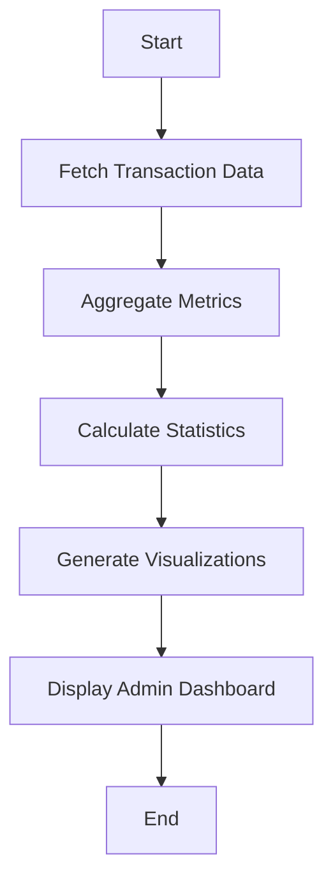

# CHAPTER FOUR: SYSTEM DESIGN AND IMPLEMENTATION

## 4.1 Objective of Design
The design of the Unicross Pay Management System aims to create an efficient and secure platform for managing university financial transactions at the University of Cross River State (UNICROSS). The primary objectives of this system are to:

- Facilitate seamless payment processes for students, including fee payments and receipt generation.
- Provide bursary staff with tools to manage expenses, verify payments, and oversee transactions.
- Enable administrative access for generating financial reports and accessing audit trails.
- Ensure security through role-based access control and user authentication.
- Deliver a user-friendly interface for students, bursary staff, and administrators.

## 4.2 System Architecture in Terms of Tiers
The Unicross Pay Management System adopts a multi-tier architecture to ensure scalability, maintainability, and robustness:

- **Presentation Layer (UI/UX)**
  - Provides access portals for students, bursary staff, and administrators.
  - Built with Next.js, React, and Tailwind CSS for responsive and interactive web interfaces.

- **Application Layer (Business Logic)**
  - Hosts the core functionalities such as payment processing, receipt generation, and user management.
  - Implements authentication and role-based access control to secure operations.

- **Data Layer**
  - Currently uses dummy data for demonstration, with plans for integration with a centralized database (e.g., PostgreSQL or MongoDB) for storing user information, transactions, and receipts.
  - Ensures data integrity and secure storage for future implementation.

- **Integration Layer**
  - Designed to connect with external services such as payment gateways and university systems for real-time transaction processing and verification in future updates.

### Figure 4.1: Unicross Pay System Architecture Diagram

```mermaid
graph TD
    A[Unicross Pay Portal] --> B[Presentation Layer]
    B --> C[Student Portal]
    B --> D[Bursary Portal]
    B --> E[Admin Portal]
    A --> F[Application Layer]
    F --> G[Payment Processing]
    F --> H[User Authentication]
    F --> I[Role-Based Access]
    A --> J[Data Layer]
    J --> K[Dummy Data (Current)]
    J --> L[Database (Future)]
    A --> M[Integration Layer]
    M --> N[Payment Gateways (Future)]
    M --> O[University Systems (Future)]
```

## 4.3 Choice of Programming Environment
- **Frontend**: Next.js, React, Tailwind CSS for responsive and modern UI design.
- **Backend**: Next.js API routes for handling server-side logic.
- **Database**: Currently using static dummy data, with plans for MongoDB or PostgreSQL for persistent storage of users, transactions, and receipts.
- **Authentication**: To be implemented with NextAuth.js or similar for secure user access.
- **State Management**: React hooks for managing component state.
- **Deployment**: Vercel for hosting and deployment, integrated with GitHub for version control.

## 4.4 Database Structure
The planned database structure for the Unicross Pay Management System will maintain strong relationships among users, transactions, and receipts. Major entities include:

- **Users**: Students, bursary staff, and administrators with role-based access.
- **Transactions**: Payment records including fees paid by students.
- **Receipts**: Generated records of transactions for student reference and bursary verification.

### Figure 4.2: Entity-Relationship Diagram – ERD



## 4.5 Database Table Definition
### User Table
| Field          | Type      | Attributes                          |
|----------------|-----------|-------------------------------------|
| _id            | ObjectId  | Primary Key                        |
| name           | String    | Required, Max length: 60           |
| email          | String    | Unique, Required, Validated        |
| passwordHash   | String    | Required                           |
| role           | String    | Enum: [student, bursary, admin], Default: student |
| createdAt      | Date      | Default: current timestamp         |

### Transaction Table
| Field          | Type      | Attributes                          |
|----------------|-----------|-------------------------------------|
| _id            | ObjectId  | Primary Key                        |
| userId         | ObjectId  | Foreign Key → User, Required       |
| type           | String    | Enum: [feePayment, other], Required|
| amount         | Number    | Required, Min: 1                   |
| status         | String    | Enum: [pending, approved, rejected], Default: pending |
| createdAt      | Date      | Default: current timestamp         |

### Receipt Table
| Field          | Type      | Attributes                          |
|----------------|-----------|-------------------------------------|
| _id            | ObjectId  | Primary Key                        |
| transactionId  | ObjectId  | Foreign Key → Transaction, Required|
| receiptId      | String    | Required, Unique                   |
| date           | String    | Required                           |
| description    | String    | Required                           |
| amountPaid     | Number    | Required                           |
| status         | String    | Required                           |
| createdAt      | Date      | Default: current timestamp         |

## 4.6 Input and Output Screen Formats
### Input Screens
- **Login Screen**: User authentication screen with email and password fields for each portal (Student, Bursary, Admin).
  - **Figure 4.3: Login Screens**
- **Payment Interface**: Form for students to input payment details for university fees.
  - **Figure 4.4: Payment Interface**
- **Transaction Verification Interface**: Interface for bursary staff to review and verify student payments.
  - **Figure 4.5: Transaction Verification Interface**

### Output Screens
- **Role-Based Dashboard**: Displays tailored information and actions based on user role (Student, Bursary, Admin).
- **Receipts List**: Shows a list of generated receipts for students with filtering options.
- **Transaction Overview Dashboard**: Provides bursary staff with a summary of transactions for verification and management.
- **Financial Reports Dashboard**: Admin-only screen for viewing detailed financial metrics and audit trails.
  - **Figure 4.6: Role-Based Dashboard / Financial Reports Dashboard**

## 4.7 Program Algorithm
### Login Algorithm:
- Input email and password → Validate credentials → Check user role → Grant role-based access to the appropriate portal.

### Payment Processing Algorithm:
- Input payment details → Validate input → Process payment (future integration with payment gateway) → Generate receipt → Update transaction status.

### Transaction Verification Algorithm:
- Bursary staff reviews pending transactions → Verify payment details → Update status to approved or rejected → Notify student (future feature).

### Reporting Algorithm:
- Fetch transaction and receipt data → Aggregate metrics → Calculate financial statistics → Generate visualizations for admin dashboard.

## 4.8 Program Flowcharts
### 4.8.1 User Login Flowchart

- **Figure 4.7: User Login Flowchart**

### 4.8.2 Payment Processing Flowchart

- **Figure 4.8: Payment Processing Flowchart**

### 4.8.3 Reporting Flowchart

- **Figure 4.9: Reporting Flowchart**

## 4.9 Hardware Requirements
- **Server**: Minimum 4GB RAM, Dual-Core CPU, 50GB SSD for hosting the application.
- **Client Devices**: Any device with a modern web browser (smartphone, tablet, or PC).
- **Network**: Stable internet connection for accessing the web application.

## 4.10 Software Requirements
- **OS**: Any OS supporting Node.js (Windows/macOS/Linux).
- **Runtime Environment**: Node.js for running the Next.js application.
- **Database**: Planned integration with MongoDB or PostgreSQL.
- **Frontend Framework**: Next.js with React for UI development.
- **Styling**: Tailwind CSS for responsive design.
- **Authentication**: Future implementation with NextAuth.js or similar.
- **Version Control**: Git/GitHub for code management.
- **Deployment**: Vercel for hosting the application.

## 4.11 Documentation
Documentation for the Unicross Pay Management System includes:

- **User Manual**: Separate guides for students, bursary staff, and administrators on using the system.
- **API Documentation**: Documentation of planned API routes and authentication requirements.
- **Database Schema**: Planned schema for user, transaction, and receipt data with relationships.
- **Installation Guide**: Step-by-step setup instructions for development and production environments.
- **System Architecture**: Overview of the multi-tier architecture and integration plans for external services.
