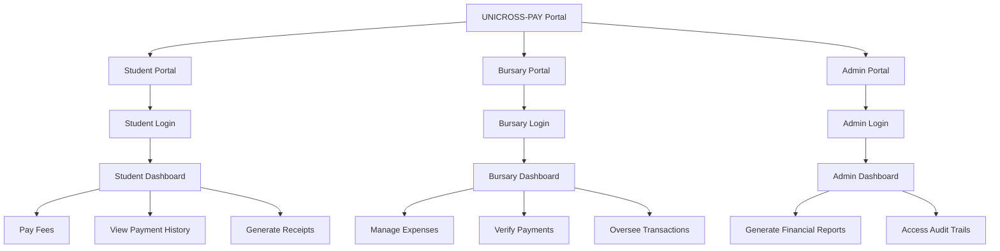
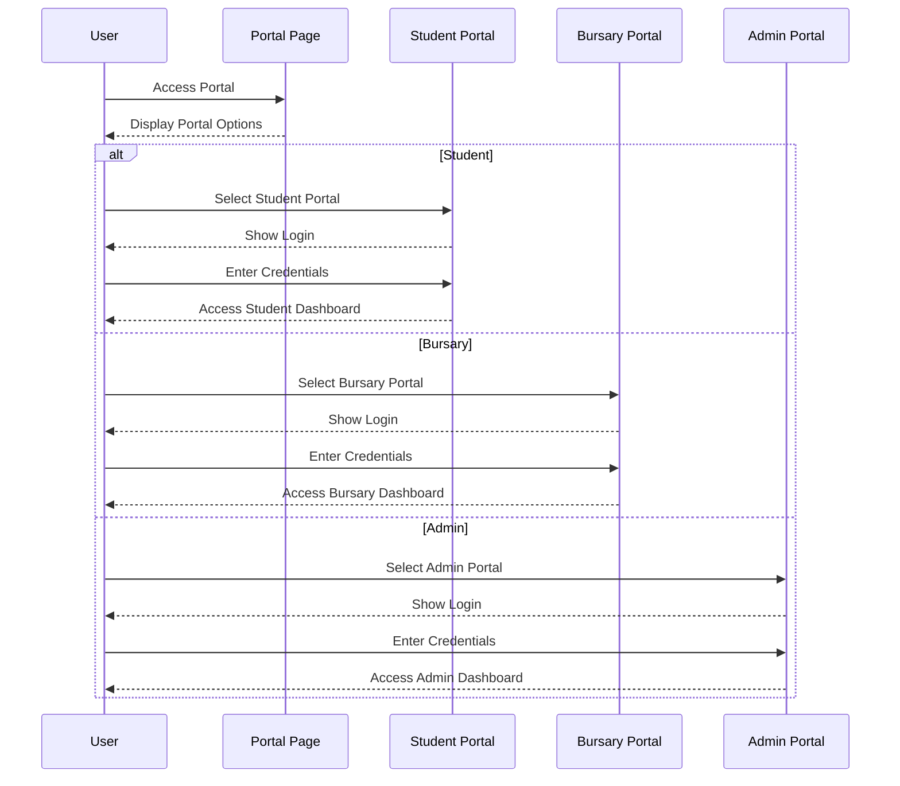

# Unicross Pay Management System Documentation

## Overview
The Unicross Pay Management System is a web application designed to facilitate university financial management. It provides three distinct portals for different user roles:

- **Student Portal**: Allows students to pay fees, view payment history, and generate receipts.
- **Bursary Portal**: Enables bursary staff to manage expenses, verify payments, and oversee transactions.
- **Admin Portal**: Provides administrative access to generate financial reports and access audit trails.

## System Architecture

The application is built using Next.js with TypeScript, utilizing React components for the user interface. The structure is organized into the following key directories:

- `app/`: Contains the main application routes and pages for each portal (student, bursary, admin).
- `components/`: Houses reusable UI components like headers, sidebars, tables, and modals.

### Key Components

- **Header**: Displays the dashboard title based on the user's role.
- **Sidebar**: Provides navigation links specific to each user role.
- **Table**: A shared component used across portals for displaying data like receipts or transactions.
- **Modals**: Used for actions like viewing detailed receipt information.

## System Diagrams

Below are diagrams representing the structure and flow of the Unicross Pay Management System, created using Mermaid syntax for clarity and to aid in understanding the system's design.

### System Architecture Diagram

### User Flow Diagram

These diagrams provide a visual representation of how the system is structured and how users interact with different portals. If additional diagrams are needed for specific components or processes, they can be added in future updates.

## User Flow

1. Users access the main portal page where they select their role.
2. After selection, they are directed to the respective login page.
3. Upon successful login, users are taken to their dashboard which features role-specific functionalities.

## Data

The system currently uses dummy data for demonstration purposes, which includes receipt information for students.

## Future Enhancements

- Integration with actual payment gateways.
- Authentication and authorization for secure access.
- Database integration for persistent data storage.

This documentation will be updated as the system evolves to include more detailed information on new features and technical implementations.
